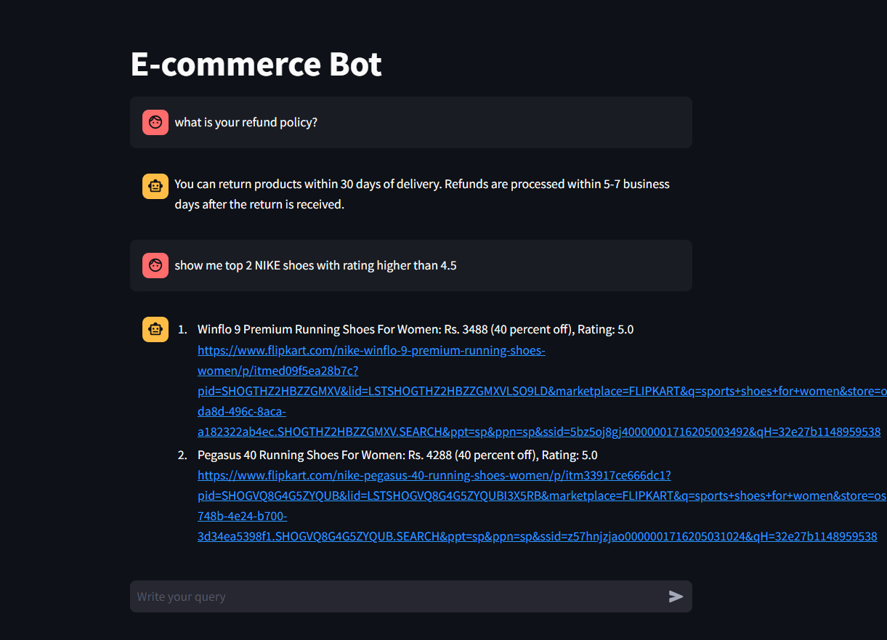
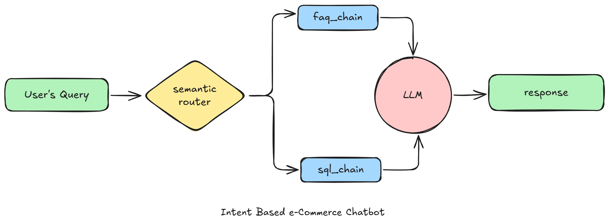

# 💬 E-Commerce Chatbot (Gen AI RAG Project using Llama 3.3 + GROQ)

An intelligent **AI-powered chatbot for e-commerce platforms** that helps users search products, ask FAQs, and get instant responses using **LLM + RAG + SQL Database Querying**.

This project demonstrates how Generative AI can be integrated into e-commerce websites to improve customer experience through smart automation.

---

# 🌐 Live Demo App

🚀 Try the chatbot here:

👉 **Streamlit Live App**  
https://e---commerce-chatbot-mohamed-aslam.streamlit.app/

---

# 🎥 Project Explanation Video

Watch the complete Loom demo and explanation of this project:

👉 **Loom Video**  
https://www.loom.com/share/4c4b5e7447c540f695e395d0ff441f22

---

# 📌 Project Overview

This chatbot currently supports **two main intents**:

### ✅ FAQ Intent

Handles customer support questions like:

- Return policy  
- Refund process  
- Payment methods  
- Shipping details  
- Promo code usage  
- Damaged product help

### ✅ SQL Intent

Handles product search requests directly from database:

- Shoes under ₹2000  
- Nike shoes below ₹3000  
- Top-rated running shoes  
- Puma shoes with discount  
- Women sports shoes  
- Cheapest branded shoes

---

# 🧠 Tech Stack

- **Python**
- **Streamlit**
- **Groq API**
- **Llama 3.3**
- **SQLite**
- **ChromaDB**
- **Sentence Transformers**
- **Semantic Router**
- **Pandas**

---

# 🚀 Key Features

✅ Intelligent user query understanding  
✅ Automatic intent detection  
✅ FAQ chatbot with RAG pipeline  
✅ Natural language product search  
✅ Real-time SQL database querying  
✅ Product links with price/rating/discount  
✅ Fast LLM responses using GROQ  
✅ Clean premium Streamlit UI  
✅ Beginner-friendly Gen AI architecture  

---

# 🧠 Supported Intents

# 1️⃣ FAQ Intent

Triggered when users ask policy or support questions.

### Examples:

- Is online payment available?  
- How can I get refund?  
- What is return policy?  
- Do you offer international shipping?  
- How to use promo code?  
- Can I cancel my order?  

---

# 2️⃣ SQL Intent

Triggered when users search products.

### Examples:

- Show me Nike shoes below Rs. 3000  
- Puma shoes with discount  
- Shoes under Rs. 2000  
- Top rated running shoes  
- Women sports shoes  
- Cheapest shoes available  

---

# 📷 Project Screenshots

## Product Search Output



---

## Architecture Diagram



---

# 🏗️ Architecture Flow

```text
User Query
   ↓
Intent Detection (Semantic Router)
   ↓
 ┌───────────────┬──────────────┐
 │               │              │
FAQ Route      SQL Route
 │               │
RAG Search     Generate SQL Query
 │               │
LLM Answer     SQLite Database
 │               │
 └────── Final Chatbot Response ──────┘

---
# 📁 Folder Structure

```text
E-Commerce-RAG/
│── app/
│   │── main.py
│   │── faq.py
│   │── sql.py
│   │── router.py
│   │── style.css
│   │── db.sqlite
│   │── .env
│   │── requirements.txt
│
│── resources/
│   │── faq_data.csv
│   │── product-ss.png
│   │── architecture-diagram.png
│
│── web-scraping/
│   │── scrape_products.py
│   │── scraped_data.csv
│
│── README.md


Copyright (C) Codebasics Inc. All rights reserved.

Additional Terms: This software is licensed under the MIT License. However, commercial use of this software is strictly prohibited without prior written permission from the author. Attribution must be given in all copies or substantial portions of the software.

