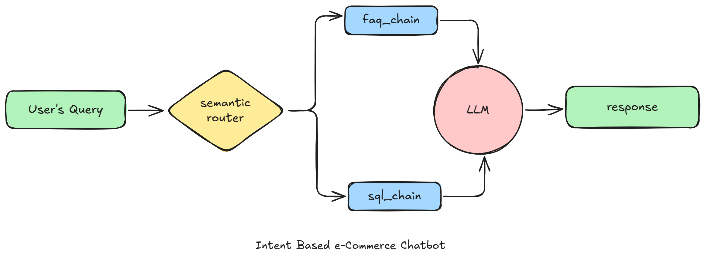

# 💬 E-Commerce Chatbot (Gen AI RAG Project using Llama 3.3 + GROQ)

An intelligent **AI-powered chatbot for e-commerce platforms** that helps users search products, ask FAQs, and get instant responses using **LLM + RAG + SQL Database Querying**.

This project demonstrates how Generative AI can be integrated into e-commerce websites to improve customer experience through smart automation.

---

# 🌐 Live Demo App

🚀 Try the chatbot here:

👉 https://e---commerce-chatbot-mohamed-aslam.streamlit.app/

---

# 🎥 Project Explanation Video

Watch the complete Loom demo and explanation of this project:

👉 https://www.loom.com/share/4c4b5e7447c540f695e395d0ff441f22

---

# 💻 GitHub Repository

👉 https://github.com/aslam347/E-Commerce-RAG

---

# 📌 Project Overview

This chatbot currently supports **two main intents**:

## ✅ FAQ Intent

Handles customer support questions like:

- Return policy  
- Refund process  
- Payment methods  
- Shipping details  
- Promo code usage  
- Damaged product help  

## ✅ SQL Intent

Handles product search requests directly from database:

- Shoes under ₹2000  
- Nike shoes below ₹3000  
- Top-rated running shoes  
- Puma shoes with discount  
- Women sports shoes  
- Cheapest branded shoes  

The chatbot intelligently routes user queries using a semantic router and generates responses using:

- Retrieval-Augmented Generation (RAG)
- SQLite product database querying
- GROQ-hosted Llama 3.3 LLM

---

# 🧠 Tech Stack

- Python  
- Streamlit  
- Groq API  
- Llama 3.3  
- SQLite  
- ChromaDB  
- Sentence Transformers  
- Semantic Router  
- Pandas  
- SQLAlchemy  
- Docker  

---

# 🚀 Key Features

✅ Intelligent user query understanding  
✅ Automatic intent detection  
✅ FAQ chatbot with RAG pipeline  
✅ Natural language product search  
✅ Real-time SQL database querying  
✅ Product links with price/rating/discount  
✅ Fast LLM responses using GROQ  
✅ Clean premium Streamlit UI  
✅ Beginner-friendly Gen AI architecture  
✅ Docker containerization support  

---

# 🧠 Supported Intents

## 1️⃣ FAQ Intent

Triggered when users ask policy or support questions.

### Example Queries

- Is online payment available?  
- How can I get refund?  
- What is return policy?  
- Do you offer international shipping?  
- How to use promo code?  
- Can I cancel my order?  

---

## 2️⃣ SQL Intent

Triggered when users search products.

### Example Queries

- Show me Nike shoes below Rs. 3000  
- Puma shoes with discount  
- Shoes under Rs. 2000  
- Top rated running shoes  
- Women sports shoes  
- Cheapest shoes available  

---

# 📷 Project Screenshots

## Product Search Output


---

## Architecture Diagram



---

# 🏗️ Architecture Flow

```text
User Query
   ↓
Intent Detection (Semantic Router)
   ↓
 ┌───────────────┬──────────────┐
 │               │              │
FAQ Route      SQL Route
 │               │
RAG Search     Generate SQL Query
 │               │
LLM Answer     SQLite Database
 │               │
 └────── Final Chatbot Response ──────┘
```

---

# 📁 Folder Structure

```bash
E-Commerce-RAG/
│
├── app/
│   ├── main.py
│   ├── faq.py
│   ├── sql.py
│   ├── router.py
│   ├── style.css
│   ├── db.sqlite
│   └── .env
│
├── resources/
│   ├── faq_data.csv
│   ├── product-ss.png
│   ├── architecture-diagram.png
│   ├── ecommerce_data_final.csv
│   └── db.sqlite
│
├── Web - Scrapping/
│   ├── csv_to_sqlite.py
│   ├── flipkart_product_data.csv
│   ├── duplicate_products.csv
│   ├── unavailable_products.csv
│   └── flipkart_data_extraction.ipynb
│
├── requirements.txt
├── Dockerfile
├── .dockerignore
├── .gitignore
└── README.md
```

---

# ⚙️ Installation & Run

## Clone Repository

```bash
git clone https://github.com/aslam347/E-Commerce-RAG.git
```

## Move Into Project

```bash
cd E-Commerce-RAG
```

## Install Dependencies

```bash
pip install -r requirements.txt
```

## Run Application

```bash
streamlit run app/main.py
```

---

# 📜 Requirements

```txt
streamlit==1.56.0
chromadb==1.5.8
protobuf==3.20.3
sentence-transformers==5.4.1
groq==1.2.0
pandas==2.3.3
python-dotenv==1.2.2
sqlalchemy==2.0.49
pandasql==0.7.3
semantic-router==0.0.72
```

---

# 🐳 Docker Containerization

This project is fully containerized using Docker.

## Build Docker Image

```bash
docker build -t ecommerce-rag .
```

## Run Docker Container

```bash
docker run --env-file app/.env -p 8501:8501 ecommerce-rag
```

## Open in Browser

```text
http://localhost:8501
```

---

# 🐳 Docker Hub

Pull and run directly from Docker Hub:

```bash
docker pull mohamedaslam2001/ecommerce-rag
docker run --env-file app/.env -p 8501:8501 mohamedaslam2001/ecommerce-rag
```

---

# 🔐 Environment Variables

Create `.env` file inside `app/`

```env
GROQ_API_KEY=your_groq_api_key
GROQ_MODEL=llama-3.3-70b-versatile
```

---

# 💡 Real Business Use Cases

This project can be applied to multiple real-world business scenarios, including:

- ✅ E-commerce customer support automation  
- ✅ AI shopping assistant  
- ✅ Smart product recommendation engine  
- ✅ FAQ resolution bot  
- ✅ Order support chatbot  
- ✅ Conversational commerce assistant  
- ✅ AI product search engine  
- ✅ Retail automation assistant  

---

# 🔥 Challenges Solved

During development, this project involved solving several real-world engineering challenges such as:

- Intent routing using semantic similarity  
- SQL query generation using LLM  
- Vector database integration with ChromaDB  
- SQLite integration inside GenAI workflow  
- Streamlit deployment optimization  
- Docker containerization  
- Environment variable management  
- Dependency conflict handling  

---

# 📚 Key Learnings

- Retrieval-Augmented Generation (RAG)  
- LLM-based SQL generation  
- Semantic Router implementation  
- ChromaDB vector search  
- SQLite database querying  
- Prompt engineering  
- Streamlit frontend development  
- Dockerizing GenAI applications  
- Production-ready AI architecture  

---

# 🙌 Author

## Mohamed Aslam

Passionate about:

- Data Science  
- Generative AI  
- AI Agents  
- Real-world AI products  
- End-to-end AI deployment  

---

# ⭐ If You Like This Project

If you found this project useful, please give this repository a **Star ⭐ on GitHub**.

---

# 📜 License

Copyright (C) Codebasics Inc. All rights reserved.

## Additional Terms

This software is licensed under the **MIT License**. However:

- Commercial use of this software is strictly prohibited without prior written permission from the author.  
- Attribution must be given in all copies or substantial portions of the software.
